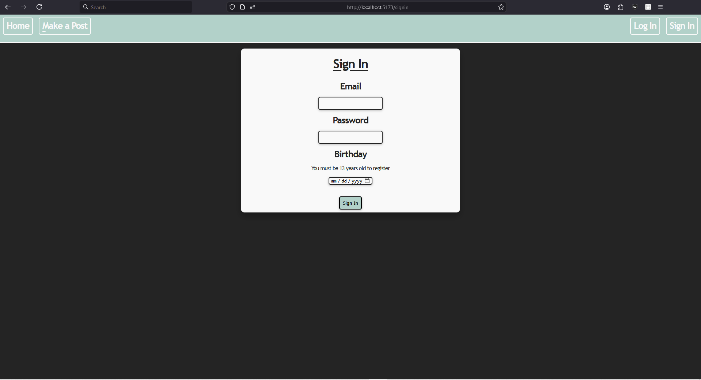
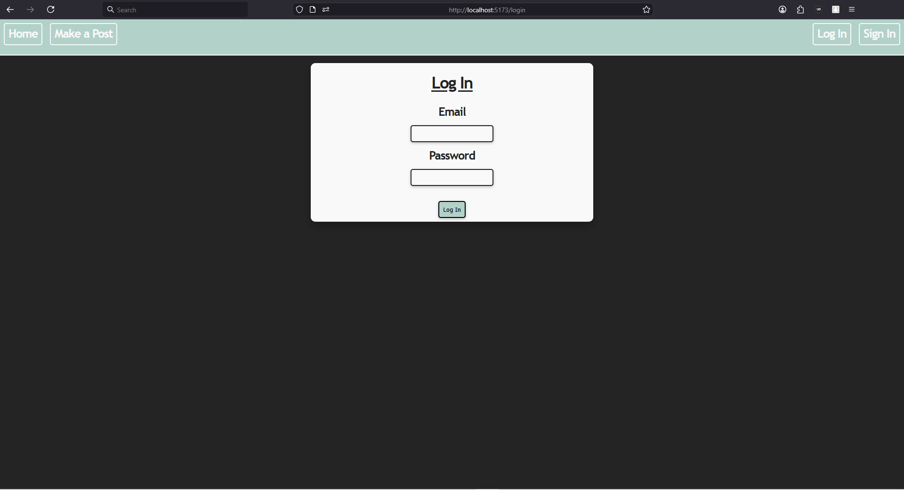
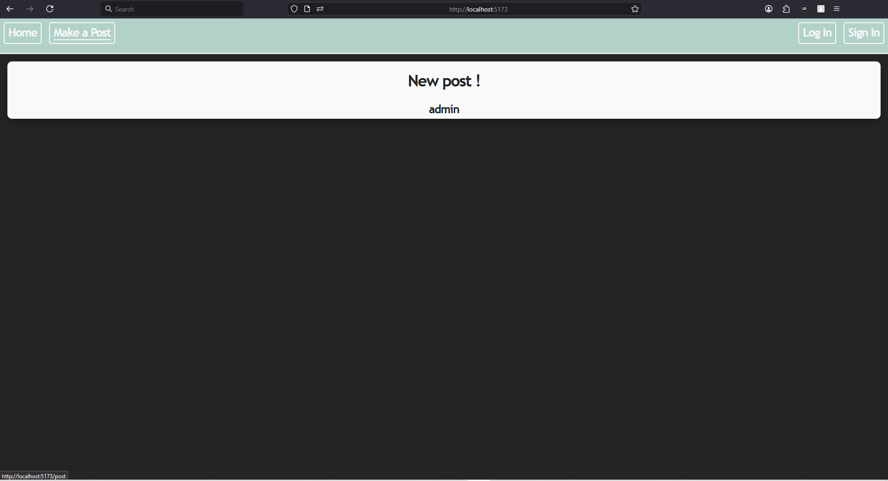
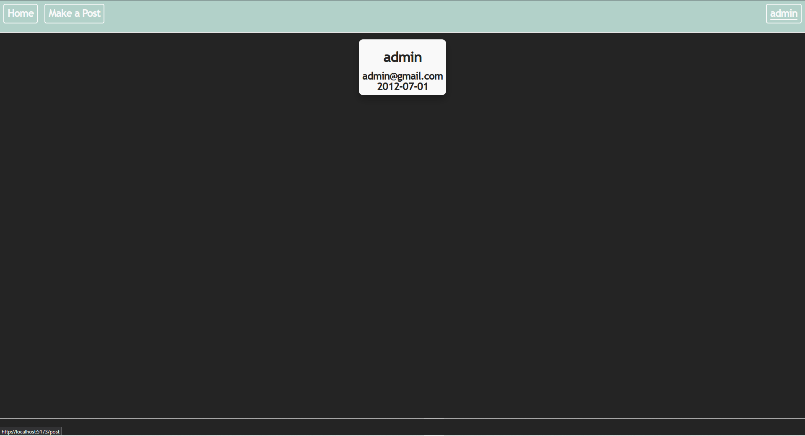

# SocialTimelineBuilder
Social Network that allows you to compare the timeline of you and your friends postes.
Made using Vue.js for the frondend, Spring Boot Java for the backend, and PHPmyadmin for the SQL database.
Note that this social network was a challenge, I made it in a week and it was my first experience with Vue and Spring Boot.
On the other side I already knew SQL, PHPmyadmin.
I'm still trying to port the project to Docker.
Note also that with a so short deadline, the website design is minimal.

The SignIn page (with full password security and working age restriction, and feedback from the backend to the front) :

The LogIn page :

The home page :

Profile preview of the admin account (a test account) :

